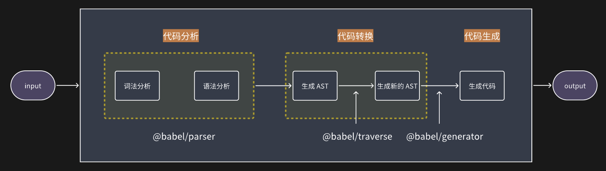

---
sidebar:
 title: 前端应该了解的 compiler
isTimeLine: true
title: 前端应该了解的 compiler
date: 2024-02-22
tags:
 - 编译器
categories:
 - 编译器
 - 进阶
---

# 前端应该了解的 compiler

## 什么是编译器？

简单的说就是从一种语言转换为另一种语言。从一种形式转换为另一种形式。

例如：
1. babel 将 es6+ 的代码转换为 es5 的代码；
2. sass 到 css 的转换；
3. Vue SFC 到 html 的转换；
4. 等等

## 整体流程



用伪代码表示就是：

```js
function compiler(input) {
  // 1. 词法分析
  const tokens = tokenizer(input);
  // 2. 语法分析
  const AST = parser(tokens);
  // 3. 代码转换
  const newAST = transformer(AST);
  // 4. 代码生成
  const output = generator(newAST);

  return output;
}
```

- **词法分析**：将输入代码转换为tokens。例如输入为 `let a = (b + 1);`，经过词法分析后，变为：`let` `a` `=` `(` `b` `+` `1` `)` `;`
- **语法分析**：将 tokens 根据文法规则转换为 AST（抽象语法树）
- **代码转换**：通常主要在这一步做处理。将原 AST 根据业务规则转换为新的 AST
- **代码生成**：再根据新的 AST 生成目标代码

## 实践

使用 [babel](https://babeljs.io/docs) 工具了解一下编译器的流程，以及 AST 的具体使用场景。

### babel 工具

1. [@babel/parser](https://babeljs.io/docs/babel-parser)
对源码进行词法分析、语法分析，生成源码对应的 AST。

2. [@babel/traverse](https://babeljs.io/docs/babel-traverse)
对 AST 做处理。负责维护整个树的状态，并负责替换、删除和添加节点。

3. [@babel/generator](https://babeljs.io/docs/babel-generator)
Babel Generator 是 Babel 的代码生成器。它能将 AST 转换成带源映射的代码。

4. [@babel/types](https://babeljs.io/docs/babel-types)
Babel Types 是一个类似于 Lodash 的 AST 节点工具库。它包含构建、验证和转换 AST 节点的方法。
Babel Types 对每种类型的节点都有定义，包括哪些属性属于哪个节点、哪些值有效、如何构建节点、如何遍历节点以及节点的别名等信息。

5. [@babel/core](https://babeljs.io/docs/babel-core)
核心编译器，核心的 API 都在这里。

### 实战

将函数名称修改为 `newFnName`。

```js
const parser = require('@babel/parser');
const traverse = require("@babel/traverse");
const generator = require("@babel/generator");

const compilerTest = (input) => {
  // 将源代码转换为 AST
  const ast = parser.parse(input);
  const visitor = {
    FunctionDeclaration: function(path) {
      path.node.id.name = "newFnName"
    }
  };
  // 对原 ast 根据 visitor 内容做了转换
  traverse.default(ast, visitor);
  // 生成代码
  const output = generator.default(ast, {}, code);
  // output 输出的值：
  // output {
  //   code: 'function newFnName(n) {\n  return n * n;\n}',
  //   decodedMap: undefined,
  //   __mergedMap: [Getter],
  //   map: [Getter/Setter],
  //   rawMappings: [Getter/Setter]
  // }
  console.log(output);
  return output.code;
}
const code = `
function test(n) {
  return n * n;
}
`
console.log(compilerTest(code));
```