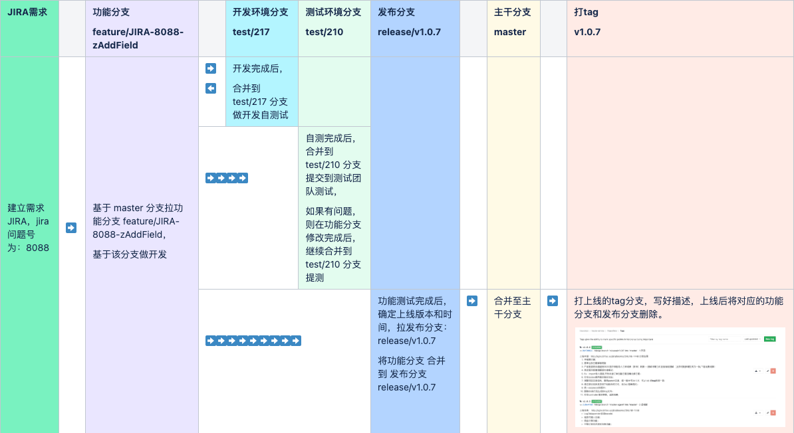
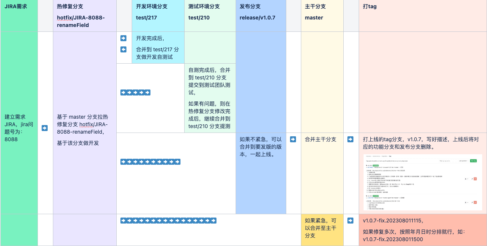

---
sidebar:
 title: git Branch 管理规范
 step: 6
isTimeLine: true
title: git Branch 管理规范
date: 2023-05-14
tags:
 - 规范
 - git
categories:
 - 规范
---

# git Branch 管理规范

## 背景

在做多人开发的项目时，往往会出现多个分支同时存在的情况，如果不统一制定一种规范的话，会产生协作上的不适。根据公司的项目场景，制定了符合团队习惯的 git 分支规范。

## 分支类型

|分支类型|分支名匹配规则|描述|
|-|-|-|
|主干分支|master|默认分支，保持和生产一致|
|功能分支|feature/*|一般一个事项对应一个功能分支，命名规则 feature/JIRA-xxxx-describe。  xxxx: 代表jira问题编码，describe: 这里简述功能说明  示例：feature/JIRA-8888-updateServiceCharge|
|发布分支|release/*|在测试完成，上线之前，将需要上线的功能分支都合并到需要上线的发布分支|
|测试分支|test/*|测试环境对应的分支，比如test/uat，test/210等|
|热修复分支|hotfix/*|从主干分支拉出，用于线上版本的Bug修复|

## 合并方向

|源分支|目标分支|图示|
|-|-|-|
|发布分支|主干分支|release/* → [主干分支]|
|热修复分支|主干分支|hotfix/* → [主干分支]|
|功能分支|测试分支|feature/* → test/*|
|功能分支|发布分支|feature/* → release/*|
|热修复分支|发布分支|hotfix/* → release/*|

## 分支流程

### 场景一：Jira 需求开发

### 场景二：线上 BUG 修复

# git Tag 使用规范

- 对`master`分支的每一次合并更新必须标记版本号。
- 仅项目管理员有权限对`master`进行合并和标记版本号。
- 对`master`标记`tag`版本，意味着该`tag`要发布到生产环境了。
- 版本号仅基于`master`分支标记，用于标识某个可发布的生产版本。
- 版本号（tag）命名规则：v主版本号.次版本号.修订号，如`v1.0.7`。

# 代码提交规范

## 基本要求

- 确为每个项目设置 git 提交用到的 `user.name` 和 `user.email` 信息，姓名使用全拼，邮箱使用公司邮箱。**严禁**随意设置其他名称或者邮箱。
- 所有 commit 必须有注释，内容简明扼要的描述本次提交的 commit 信息覆盖哪些内容。**严禁**注释内容过于简单或者不能明确表达提交内容的 commit message 出现。
- 合理控制提交内容的颗粒度。一次commit包含一个独立的功能点。**严禁**一次提交涵盖多个功能项。

## commit message 日志规范

### type 说明

|类型|描述|
|-|-|
|feat|新功能|
|fix|修复问题|
|perf|优化，比如提升性能、体验等|
|docs|修改文档，比如 readme 文件，changelog 文件，contribute 文件等|
|style|代码格式修改。如空格、缩进等，不改变代码逻辑。|
|refactor|代码重构，没有新功能添加，也没有修复的问题。|
|revert|回滚到上一个版本。|
|test|测试用例修改。|
|chore|改变构建流程、添加依赖库、工具等。|

### subject 说明

简明扼要的说清楚本次提交的内容。

关联相关的 issue 或者需求说明，如 JIRA-8088，需求链接等。

# 项目权限

git 权限分为管理员、开发者、浏览者三种类型。

|权限|说明|
|-|-|
|浏览者|只能浏览代码，无 push、pull request 等所有的写权限|
|开发者|拥有浏览、push 非主分支、提交 pull request 工单权限|
|管理员|拥有建立和管理 git 项目，合并分支和代码、给 master 打 tag 版本号等权限|
